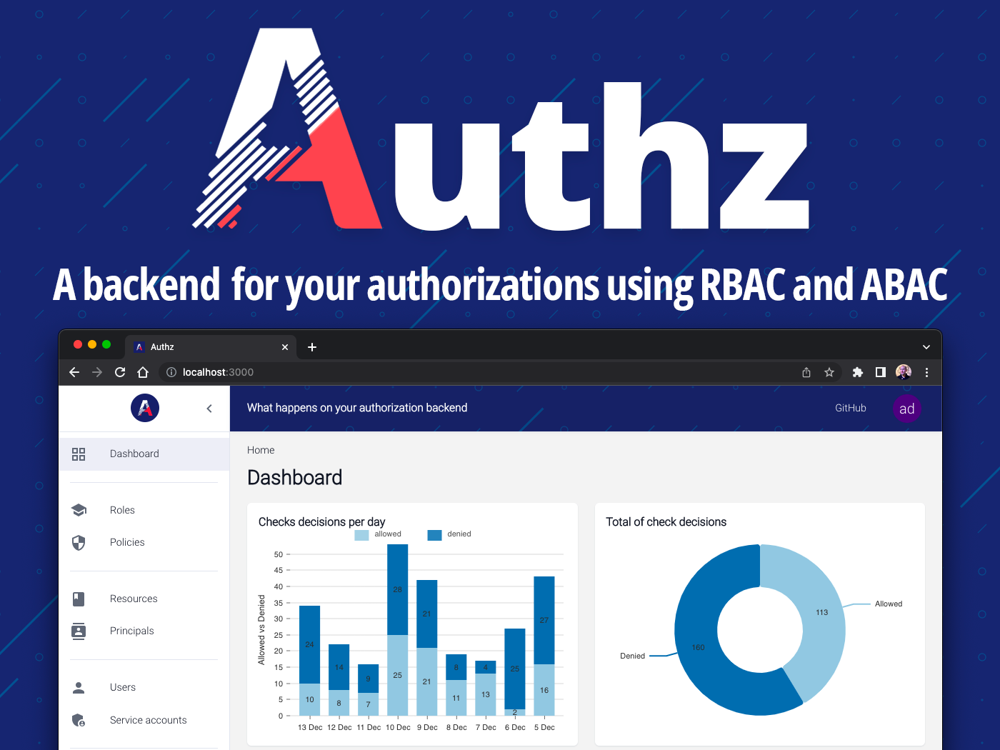

[](https://github.com/eko/authz/actions/workflows/branches.yaml)
[](https://reports.cucumber.io/report-collections/d514b46e-9225-4ae8-afbb-5f825ca2b3df)
[](https://goreportcard.com/report/github.com/eko/authz/backend)


🛡️ Authz - Authorization backend
================================

<h1 align="center"><a href="https://github.com/eko/authz"></a></h1>

This project brings a backend server with its frontend for managing authorizations.

You can use both Role-Based Acccess Control (RBAC) and Attribute-Based Access Control (ABAC).

## Why use it?

🌍  A centralized backend for all your applications authorizations

🙋‍♂️  Supports Role-Based Access Control (RBAC)

📌  Supports Attribute-Based Access Control (ABAC)

⚙️   Multiple language SDKs available

✅  Reliable: Authz uses Authz itself for managing its own internal authorizations

🔍  Audit: We log each check decisions and which policy matched

🔐  Single Sign-On: Use your enterprise SSO to log into the web UI, using OpenID Connect

🕵️‍♂️  Observability: Retrieve metrics and tracing data into your prefered tools

More information on [authz.fr](https://authz.fr)

## How it works?

Authorization is simple: a `principal` wants to make an `action` on a `resource`. That's it.

Authz allows you to manage all the authorizations you want to manage. All of them, centralized in a single application.

<picture>
  <source media="(prefers-color-scheme: dark)" srcset="docs/architecture/howitworks.dark.png">
  
</picture>

All you need to do is to host the backend server (a Go single binary), the frontend (static files) if you want it and use our SDKs.

All data are stored in a SQL database. We currently support:

* [PostgreSQL](https://www.postgresql.org/)
* [MySQL](https://www.mysql.com/fr/)
* [SQLite](https://www.sqlite.org/)


You can run a development environment using our [`docker-compose.mysql.yaml`](https://github.com/eko/authz/blob/master/docker-compose.mysql.yaml) and [`docker-compose.postgres.yaml`](https://github.com/eko/authz/blob/master/docker-compose.postgres.yaml) files. Or, you can see below to run an example using SQLite.

## SDKs

In order to help you, we have the following available SDKs:

* [Go](https://github.com/eko/authz/tree/master/sdk) - [pkg.go.dev](https://pkg.go.dev/github.com/eko/authz/sdk)
* [Python](https://github.com/eko/authz-python-sdk) - [pypi](https://pypi.org/project/authz-sdk/)
* [PHP](https://github.com/eko/authz-php-sdk) - [packagist](https://packagist.org/packages/eko/authz-sdk)
* [NodeJS](https://github.com/eko/authz-nodejs-sdk) - [npmjs](https://www.npmjs.com/package/@eko/authz-sdk)

Please check their documentations for detailled usage. They all use `gRPC` for communicating with the Authz backend (server-to-server).

More SDKs are coming soon.

## Getting started

The best way to start trying Authz is to use the following standalone Docker image:


```bash
$ docker run --rm \
    -e database_driver=sqlite \
    -e database_name=:memory: \
    -p 8080:8080 \
    -p 8081:8081 \
    -p 3000:80 \
    ekofr/authz:v0.8.0-standalone
```

Here, we use SQLite in-memory as database.

Frontend will be available under [http://localhost:3000](http://localhost:3000) with default credentials: `admin` / `changeme`.

Alternatively, we also have separated `backend` and `frontend` Docker images available here: [https://hub.docker.com/repository/docker/ekofr/authz](https://hub.docker.com/repository/docker/ekofr/authz).

## Documentation

More technical documentations are available at [https://docs.authz.fr](https://docs.authz.fr).

## Backend

For more information about backend, please refer to the [Backend](https://github.com/eko/authz/tree/master/backend) README file.

## Frontend

For more information about frontend, please refer to the [Frontend](https://github.com/eko/authz/tree/master/frontend) README file.

## Community

Please feel free to contribute on this project and do not hesitate to open an issue if you want to discuss about a feature.
