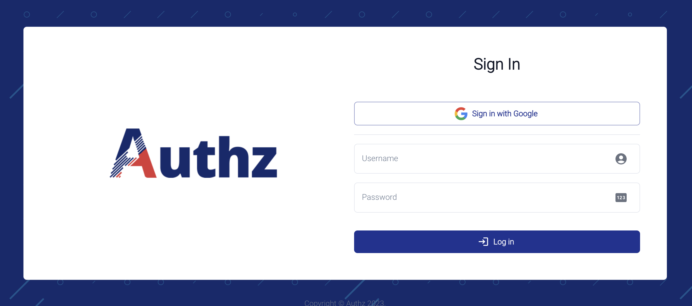

# Authentication - OpenID Connect

Authz can be setup in order to use OAuth's OpenID Connect protocol.

It can be used to access the frontend.

## Configuration

First, you have to ensure to have all the information needed to act as an OpenID Connect client: your issuer `URL`, a `client_id`, `client_secret` and also the `scopes` you want to retrieve.

### Backend

On backend side, fill in these values:

| Property | Default value | Description |
| -------- | ------------- | ----------- |
| OAUTH_CLIENT_ID | N/A | OAuth client ID provided by your issuer |
| OAUTH_CLIENT_SECRET | N/A | OAuth client Secret provider by your issuer |
| OAUTH_COOKIES_DOMAIN_NAME | `localhost` | OAuth domain name on which cookies will be stored |
| OAUTH_FRONTEND_REDIRECT_URL | `http://localhost:3000` | Frontend redirect URL when OAuth authentication is successful |
| OAUTH_ISSUER_URL | N/A | Issuer OpenID Connect URL (will be used to retrieve /.well-known/openid-configuration) |
| OAUTH_REDIRECT_URL | `[12h](http://localhost:8080/v1/oauth/callback)` | Backend OAuth callback URL |
| OAUTH_SCOPES | `profile,email` | OAuth scopes to be retrieved from your issuer |

### Frontend

On frontend side (**build-time only**), fill in these values:

| Property | Default value | Description |
| -------- | ------------- | ----------- |
| REACT_APP_OAUTH_BUTTON_LABEL | `Sign-in wigh Single Sign-On (SSO)` | Sign in button label (will make it appear on front) |
| REACT_APP_OAUTH_ENABLED | `false` | Should OAuth authentication button be displayed on front? |
| REACT_APP_OAUTH_LOGO_URL | N/A | Sign in button logo URL that will appear on left |

## You're ready to authenticate!

Run your built front and click on the button to try your OpenID Connect authentication.

On your first login, you will need to authenticate back with your admin user in order to add the desired permissions to your newly created principal (prefixed by `authz-user-`).