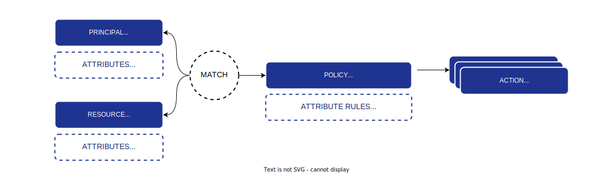

# Using Attribute-Based Access Control (ABAC)



You can give a `principal` authorization to do action on resources depending on resources attributes, without having to give him a `role`.

This can be done by creating a `policy` that contains some `attribute_rules`.

## Attribute rules

Attribute rules can have multiple formats.

First, you can check for both resource and principal attribute names:

```
resource.<attribute_name> == principal.<attribute_name>
resource.<attribute_name> != principal.<attribute_name>
```

Or, you can check for a specific value of a resource attribute:

```
resource.<attribute_name> == <a value>
resource.<attribute_name> != <a value>
```

Or, you can check for a specific value of a principal attribute:

```
principal.<attribute_name> == <a value>
principal.<attribute_name> != <a value>
```

## Blog post example

To help you understand this, here is a concrete example:

Imagine a user named `john`, we create a principal with identifier `user-john` with an `email` attribute having value `john@acme.tld`.

Now, a new blog post is created with an identifier `post.1` and attribute an `owner_email` with value `john@acme.tld`. We also declare that on this resource we can do the following actions: `edit` and `delete`.

In order to give authorization to user `john` to perform `edit` and `delete` actions on all the posts on which he is the owner, we can now create a policy.

Add a policy named `post-owners-edit` that gives access to resources `post.*` (wildcard signifies all posts) to perform actions `edit` and `delete`.

If we stop here, the policy will not match the principal because it should be added to a `role` and give that role to the `john` principal.

Or, you can also specify an attribute rule to the policy you just create to specify: `principal.email == resource.owner_email`.

In this case, the policy will match both the principal `email` attribute and the resource `owner_email` attribute. This will allow John to edit its post!

You can now perform a check, John will be able to edit its blog post.