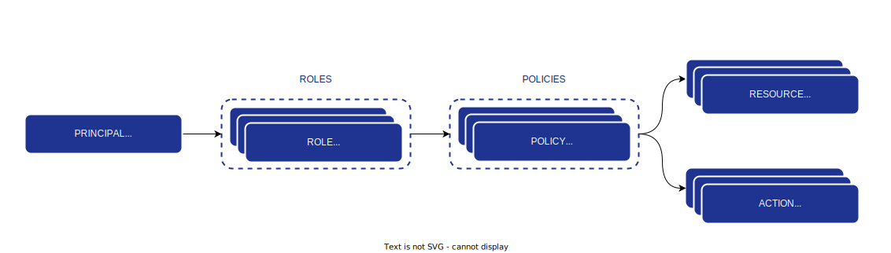

# Using Role-Based Access Control (RBAC)

First, you have to declare `policies` for which each policy will contain one or multiple `actions` that can be done on one or multiple `resources`.

Once you have declared your policies, you can create `roles`, depending on how you want to structure and give them in your organization.

A role can contain multiple `policies`.

You can give `roles` to `principals` in order to give them authorization to do action on resources.

## Content Management System example

Let's imagine you are using Authz to declare some policies and roles for your Content Management System.

You have the following resources in your CMS:
* Pages: some content pages
* Posts: some blog posts

### Declare policies

You can create the following 3 policies:

* A policy named `pages-creator` which gives the following permissions:
  * Resources: `pages.*` (you can use notation wildcard `*` to specify all `pages` resources)
  * Actions: `create`

* A policy named `posts-creator` which gives the following permissions:
  * Resources: `posts.*` (you can use notation wildcard `*` to specify all `posts` resources)
  * Actions: `create`

* A policy named `pages-editor` which gives the following permissions:
  * Resources: `pages.*` (you can use notation wildcard `*` to specify all `pages` resources)
  * Actions: `edit`, `delete`

* A policy named `posts-editor` which gives the following permissions:
  * Resources: `posts.*` (you can use notation wildcard `*` to specify all `posts` resources)
  * Actions: `edit`, `delete`

## Declare roles

Now, you can create, for instance, the following roles:

* A role named `cms-creator`, which gives the following policies:
  * `pages-creatorr`
  * `posts-creator`

* A role named `cms-editor`, which gives the following policies:
  * `pages-editor`
  * `posts-editor`

## Attach roles to a principal

Finally, you can attach or or multiple roles to a `principal` so it will have access to the policies declared in roles.